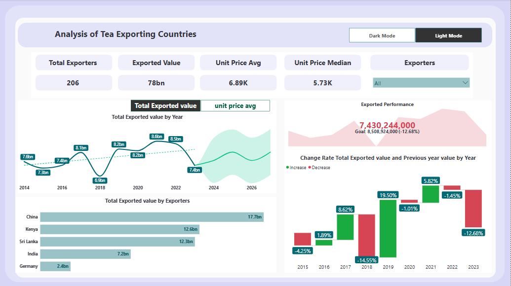
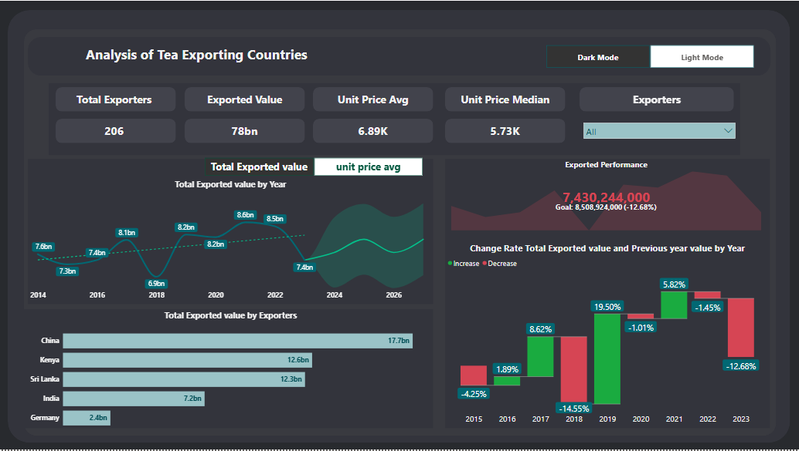

# 📊 Analysis of Tea Exporting Countries

## Overview
this project presents an interactive dashboard analyzing the performance of tea-exporting countries worldwide. The analysis leverages key performance indicators (KPIs), trend analysis, and comparative insights to highlight global tea export dynamics between 2014 and 2023.

## 🧹  Data Cleaning 
 load data in Power BI:

Click Transform Data → it opens Power Query Editor.

Common Cleaning Steps:

Rename Columns → make them clear and consistent.

Change Data Types → set columns to correct types (Date, Decimal, Whole Number, Text).

Remove Unnecessary Columns → right-click column → Remove.

Remove Blank or Error Rows:

Home → Remove Rows → Remove Blank Rows / Remove Errors.

Handle Missing Values (Nulls):

Replace with a fixed value → Transform → Replace Values.

Or remove rows with nulls.

Format Text Columns:

Transform → Format → Trim, Clean, UPPER/lower case.

## 📊  Removing Outliers in Power BI
🔹  Using IQR (Interquartile Range)

In Power Query, calculate:

Q1 (25th percentile)

Q3 (75th percentile)

IQR = Q3 – Q1

Define outliers as:

Values < Q1 – 1.5 × IQR

Values > Q3 + 1.5 × IQR

Filter out those rows.

(You can use Group By → Statistics → Percentile to get quartiles or write a custom M function).

## 🔹  Data Modeling 
 we use Data modeling in this project  to organize   tables into Fact & Dimension structure, creating relationships, and using DAX for calculations. This ensures your dashboards are fast, accurate, and scalable.
## 🔑 Key Insights
- **Exporters:** 206 countries participated in tea exports.  
- **Total Exported Value:** $78 billion in total exports.  
- **Unit Price Trends:**  
  - Average unit price: **6.89K**  
  - Median unit price: **5.73K**
 
    ## 📈 Performance Trends
- **Growth Years:** 2016 (**+1.89%**) , 2017 (**+8.62%**),2019(**+19.50%**)and 2021 (**+5.82%**).  
- **Decline Years:** 2015 (**-4.25%**),2018 (**-14.55%**),2020 (**-1.01%**),2022 (**-1.45%**)and 2023 (**-12.60%**).

- ## 🌍 Top Exporting Countries
- **China** – 17.7bn  
- **Kenya** – 12.6bn  
- **Sri Lanka** – 12.3bn  
- **India** – 7.2bn  
- **Germany** – 2.4bn

  ## 🎯 Strategic Insights
  Tea export performance is **highly volatile**.  
- **China dominates** global exports, with Kenya and Sri Lanka as strong regional players.  
- Exporters experiencing decline should reconsider **pricing strategies** and **market positioning**.  
  
 
    
## 📸 Dashboard Preview
## Light mode

## Dark mode

## 🛠️ Tools & Technologies
- **Power BI** – for dashboard design and visualization.  
- **Dataset** – Historical tea export data (2014–2023).

  ## 📌 Conclusion
  ✅ This project provides stakeholders with a clear understanding of global tea export patterns, empowering decision-makers to identify growth opportunities, address challenges, and benchmark performance against leading exporters.

